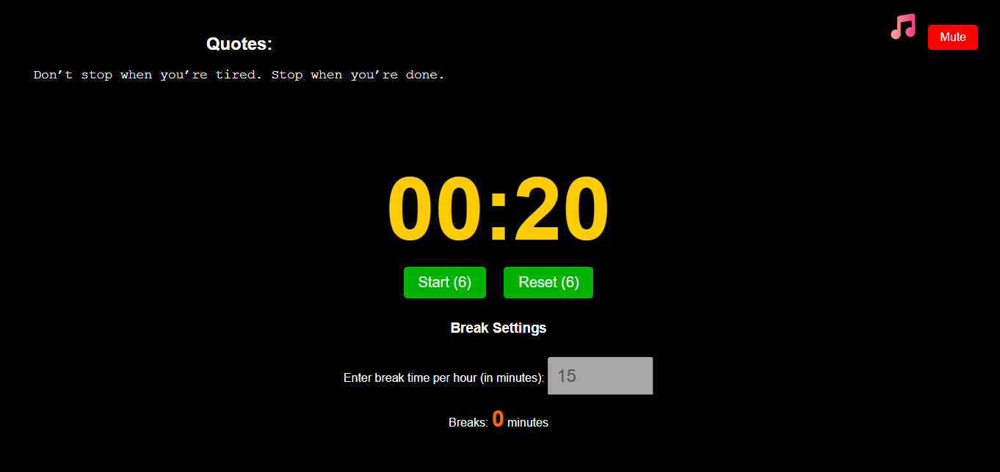

FlowClock - A Smart & Minimal Stopwatch that helps you being productive

⏳ FlowClock is a feature-rich stopwatch designed to enhance focus and productivity. It includes break timers, motivational quotes, and background music support to keep you in the flow while tracking time.

🚀 Features

✔️ Simple and clean UI

✔️ Start, pause, and reset functionality

✔️ Custom break timers

✔️ Motivational quotes for productivity

✔️ Background music integration

✔️ Lightweight and fast (Vanilla JS)

📺 Installation

Clone the repository:

sh

Copy

git clone https://github.com/DebugBeast/flowclock.git

cd flowclock

Open index.html in your browser to start using flowclock.

💡 Usage

Click Start to begin tracking time.

Use Pause/Resume for breaks.

Enjoy motivational quotes and background music for focus.

🌍 Live Demo
🚀 Live Demo – Coming soon!

🔧 Deployment

You can easily deploy FlowClock using services like Vercel for seamless hosting with continuous deployment from GitHub.

🛠 Prerequisites

A modern web browser (e.g., Chrome, Firefox)

 ** Known Issues / To-Do
 
 Improve mobile responsiveness (Already responsive enough for mobile devices but still some...)
 
 Add additional themes for the UI
 
 Add user-customizable timer sounds

 
🤝 Contributing

Want to improve FlowClock? Contributions are welcome!

Fork the repository

Create a new branch (git checkout -b feature-name)

Commit your changes (git commit -m "Added new feature")

Push to your fork (git push origin feature-name)

Create a pull request

🐟 License

This project is licensed under the MIT License.
